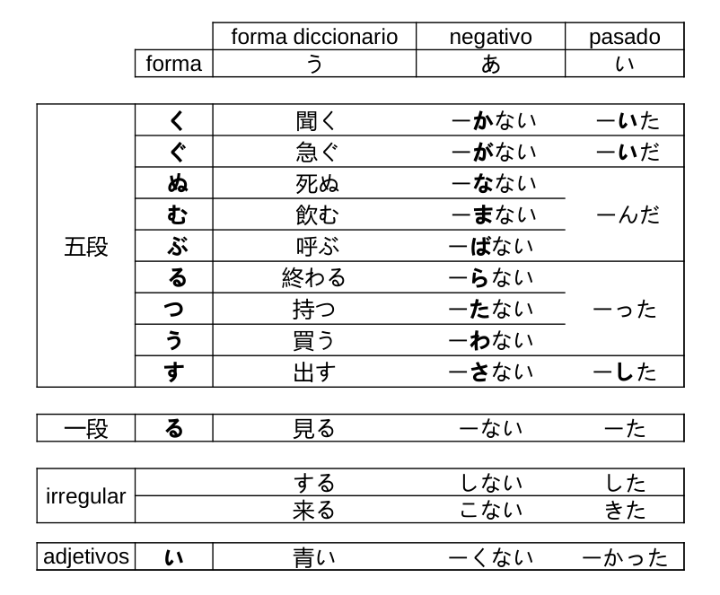

# Tarea 2

## Guía

## Convertir los siguientes verbos (ichidan) a pasado, negativo y pasado negativo

1. 書く
2. 泳ぐ
3. 死ぬ
4. 住む
5. 登る
6. 勝つ
7. 立つ
8. 会う
9. 話す

## Convertir los siguientes verbos (godan) a...

### Pasado

1. 食べる
2. 着る
3. いる

### Negativo

1. 覚える
2. 開ける
3. 閉める

### Pasado negativo

1. 答える
2. 起きる
3. 見る

## Escucha la frase y anota en que forma esta la ultima palabra.

(Puntos extras por tambien anotar la palabra final)

1.  
2.  
3.  
4.  
5.  
6.  
7.  
8.  
9.  
10. 
11. 
12. 
